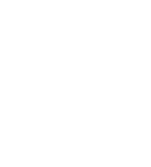

<p align="center">
  
</p>

<h1 align="center">Cally Assessment Hub</h1>

<p align="center">
  <b>The modern Next.js and Supabase-powered BPO recruitment and candidate evaluation platform.</b><br>
  Multi-metric writing analysis, interactive audio/cognitive testing, responsive 3-mode theming, and support workflows.
</p>

<p align="center">
  
  
  
  
  
</p>

<p align="center">
  <a href="#-overview">Overview</a> •
  <a href="#-key-features">Features</a> •
  <a href="#-tech-stack">Tech Stack</a> •
  <a href="#-build-and-test">Build & Test</a> •
  <a href="#-repository-layout">Repository Layout</a> •
  <a href="#-getting-started">Getting Started</a> •
  <a href="#-license">License</a>
</p>

---

## 🔭 Overview

**Cally Assessment Hub** is a modern, full-stack web application designed for Business Process Outsourcing (BPO) candidate screening, linguistic proficiency testing, and technical skills evaluation. Developed by **TephdyTech**, the platform features automated simulations, historical progress tracking, and verifiable PDF certificate generation.

---

## 🚀 Key Features

* **Authentication & User Management**: Secure login and account registration via Supabase Auth (Google OAuth or Email/Password credentials).
* **5 Core BPO Assessment Modules**:
  1. 🎧 **Listening & Dictation**: Single-play audio drills with dictation inputs and auto-evaluations under time pressure.
  2. 📖 **Sentence Completion & Grammar**: SVAR vocabulary fill-in-the-blanks and grammar rules comprehension.
  3. ✍️ **Customer Email & Chat Writing**: Professional customer service response drafting and evaluation.
  4. 🎙️ **Repeat & Retell AI**: Speaking simulation with audio recording and voice critique components.
  5. ⌨️ **Chat & Typing Speed Test**: Real-time Net Words Per Minute (WPM) and accuracy calculation for candidate screening.
* **Full Exam Pathway**: A structured 5-step sequential examination mode that compiles module performance into a cumulative rating.
* **Verifiable Certification**: Automatically generates an official electronic certificate complete with a custom verification code, score breakdown, and instant export to `.pdf` format using `html2pdf.js`.
* **Performance Logs & Historical Analytics**: Chronological tracking of every test attempt, score evolution, historical averages, and improvement metrics.
* **Dynamic UI Themes**: Seamless theme switching between **Light**, **Dark**, and **Midnight** modes with persistent storage.

---

## 🛠️ Tech Stack

* **Framework**: [Next.js](https://nextjs.org/) (React / App Router / TypeScript)
* **Styling**: [Tailwind CSS](https://tailwindcss.com/)
* **Backend & Database**: [Supabase](https://supabase.com/) (PostgreSQL Database, Auth, and Table Integration)
* **PDF Export**: `html2pdf.js`
* **Audio & Speech**: Web Speech API / HTML5 Audio & Custom Media Recorders

---

## 📋 Database Schema (Supabase)

The application expects the following core tables configured in your Supabase project:

1. **`users`**
   * `id` (UUID / Primary Key)
   * `email` (Text / Unique)
   * `name` (Text)
   * `created_at` (Timestamp)

2. **`module_scores`**
   * `id` (UUID / Primary Key)
   * `user_id` (UUID / Foreign Key to `users`)
   * `module_name` (Text)
   * `score` (Integer)
   * `created_at` (Timestamp)

3. **`certificates`**
   * `id` (UUID / Primary Key)
   * `user_id` (UUID / Foreign Key to `users`)
   * `certificate_code` (Text)
   * `overall_score` (Integer)
   * `created_at` (Timestamp)

---

## 🛠️ Build and Test

### Prerequisites

* Node.js (v18.x or higher)
* npm or yarn package manager
* Supabase project credentials

### Install, Build & Lint

```bash
# Restore / install dependencies
npm install

# Verify code formatting and linting
npm run lint

# Compile production build
npm run build

```

---

## 🚀 Getting Started

Follow these steps to set up and run Cally locally on your machine:

### 1. Clone the repository

Clone the repository to your local machine using your terminal or VS Code:

```bash
git clone [https://github.com/your-username/cally-assessment-hub.git](https://github.com/your-username/cally-assessment-hub.git)
cd cally-assessment-hub

```

### 2. Install dependencies

Install all required project dependencies using npm:

```bash
npm install

```

### 3. Configure environment variables

Create a `.env.local` file in the root directory and configure your necessary environment keys:

```env
NEXT_PUBLIC_SUPABASE_URL=your_supabase_project_url
NEXT_PUBLIC_SUPABASE_ANON_KEY=your_supabase_anon_key

```

### 4. Run the development server

Start the Next.js local development server:

```bash
npm run dev

```

Open `http://localhost:3000` in your browser to view the running application.

---

## 📁 Repository Layout

```text
ielts-prep-app/
├── prisma/                    # Prisma ORM schemas & database migrations
├── public/                    # Static brand assets and media files
├── src/
│   ├── app/
│   │   ├── api/               # Backend API routes (evaluations, exams, login)
│   │   ├── banner.png         # Official platform branding banner
│   │   ├── globals.css        # Global styling & Tailwind CSS directives
│   │   ├── layout.tsx         # Root Next.js application layout
│   │   └── page.tsx           # Main dashboard entry point
│   ├── components/            # Reusable UI widgets (AudioPlayer, Recorder, Timer)
│   ├── data/                  # Structured datasets & test question banks
│   └── lib/                   # Core utilities (Supabase client, Prisma, AI generators)
├── .env                       # Environment variable configuration
└── package.json               # Project dependencies & scripts

```

---

## 📄 License

This project is open source and available under the MIT License.

```

```
